# API 与数据库参考 (自动生成)

## 数据库 ER 图

_来源: `packages/db/prisma/schema.prisma` · 45 个模型 · 23 条关系 · 复现 `node scripts/gen-docs.mjs`_

关系边按无序模型对去重以保证可读性；完整字段与约束以 schema.prisma 为准。

```mermaid
erDiagram
  Task ||--o{ TaskTrace : "traces"
  Material ||--o{ Slice : "slices"
  Material ||--o{ MaterialAngle : "angles"
  VideoAsset ||--o{ VideoSegment : "segments"
  VideoSegment ||--o{ VideoTagAssignment : "tags"
  VideoSegment ||--o{ EmbeddingVector : "embeddings"
  VideoTag ||--o{ VideoTagAssignment : "assignments"
  TrendSource ||--o{ TrendItem : "items"
  Script ||--o{ Shot : "shots"
  Project ||--o{ Conversation : "conversations"
  Project ||--o{ ProjectScriptVersion : "scriptVersions"
  Project ||--o{ ProjectRenderVersion : "renderVersions"
  ProjectScriptVersion ||--o{ ProjectRenderVersion : "renderVersions"
  ReferenceVideo ||--o{ VideoSceneTruth : "sceneTruths"
  ProductVocInsight ||--o{ ProductReviewInsight : "reviews"
  CreativePerformance ||--o{ VideoSceneTruth : "sceneTruths"
  Recipe ||--o{ RecipeClone : "clones"
  AgentRun ||--o{ AgentStep : "steps"
  AgentRun ||--o{ AgentArtifact : "artifacts"
  AgentStep ||--o{ AgentToolCall : "toolCalls"
  AgentStep ||--o{ AgentArtifact : "artifacts"
  TrustNode ||--o{ TrustEdge : "outgoing"
  TournamentRun ||--o{ TournamentVariant : "variants"
  Task {
    string id PK
    string type
    string status
    int progress
    string step
    string error
    json payload
    datetime createdAt
    datetime updatedAt
  }
  TaskTrace {
    string id PK
    string taskId
    string step
    int progress
    string message
    json data
    datetime createdAt
  }
  Material {
    string id PK
    string productId
    string name
    string type
    string sourceUrl
    string sourceObjectKey
    string sourceDeclaration
    datetime uploadedAt
  }
  Slice {
    string id PK
    string materialId
    string thumbnailUrl
    string thumbnailObjectKey
    string clipUrl
    string clipObjectKey
    float startTime
    float endTime
    json tags
    string summary
    json embedding
  }
  MaterialAngle {
    string id PK
    string materialId
    string productId
    string view
    string key
    string label
    string imageUrl
    string referenceImageUrl
    string previewUrl
    string sourceImageUrl
    string promptHint
    json pose
    string provider
    string status
    string note
    datetime createdAt
    datetime updatedAt
  }
  VideoAsset {
    string id PK
    string productId
    string sourceUrl
    string sourceObjectKey
    string sourceDeclaration
    string title
    string platform
    int durationMs
    string contentHash
    datetime createdAt
    datetime updatedAt
  }
  VideoSegment {
    string id PK
    string videoId
    int startMs
    int endMs
    string transcript
    string visualSummary
    string thumbnailUrl
    string clipUrl
    string contentHash
    datetime createdAt
    datetime updatedAt
  }
  VideoTag {
    string id PK
    string namespace
    string name
    string normalizedName
    string description
    datetime createdAt
    datetime updatedAt
  }
  VideoTagAssignment {
    string segmentId
    string tagId
    float confidence
    string source
    string modelVersion
    json evidence
    datetime createdAt
  }
  EmbeddingVector {
    string id PK
    string ownerType
    string ownerId
    string segmentId
    string embeddingModel
    int dims
    json vector
    string quantizedObject
    string vectorHash
    json metadata
    datetime createdAt
    datetime updatedAt
  }
  EmbeddingVersion {
    string id PK
    string modelId
    int dims
    string quantization
    string vectorStore
    json promptPolicy
    bool isActive
    datetime createdAt
    datetime lastRebuiltAt
  }
  RetrievalJob {
    string id PK
    string source
    string status
    string cursor
    json filters
    json stats
    string error
    datetime scheduledFor
    datetime startedAt
    datetime finishedAt
    datetime createdAt
    datetime updatedAt
  }
  TrendSource {
    string id PK
    string platform
    string name
    string url
    bool enabled
    string refreshCron
    json config
    datetime createdAt
    datetime updatedAt
  }
  TrendItem {
    string id PK
    string sourceId
    string externalId
    string title
    string url
    json tags
    json metrics
    string embeddingId
    datetime fetchedAt
    datetime createdAt
    datetime updatedAt
  }
  Script {
    string id PK
    string productId
    string generationProfile
    string productUrl
    string referenceImageUrl
    string materialIds
    string sourceMode
    string sourceRef
    string narrative
    string visualStyle
    string bgm
    string aspectRatio
    string language
    string constraints
    datetime createdAt
    datetime updatedAt
  }
  Shot {
    string id PK
    string scriptId
    int order
    int duration
    string visualDesc
    string camera
    string narration
    string subtitle
    string materialRef
    string transition
    json factors
    string status
    string assetUrl
    string assetObjectKey
    string claimIds
    string evidenceIds
  }
  Project {
    string id PK
    string title
    string productId
    string productTitle
    string status
    string activeConversationId
    string activeScriptVersionId
    string activeRenderVersionId
    string activeTaskId
    string activeRunId
    json snapshot
    datetime createdAt
    datetime updatedAt
  }
  Conversation {
    string id PK
    string projectId
    string title
    json messages
    json activityItems
    json magicProgress
    string activeTaskId
    string activeRunId
    string activeScriptId
    json snapshot
    datetime createdAt
    datetime updatedAt
  }
  ProjectScriptVersion {
    string id PK
    string projectId
    string label
    string scriptId
    string sourceRunId
    json scriptSnapshot
    datetime createdAt
    datetime updatedAt
  }
  ProjectRenderVersion {
    string id PK
    string projectId
    string scriptVersionId
    string label
    string taskId
    string videoId
    string status
    json result
    datetime createdAt
    datetime updatedAt
  }
  ReferenceVideo {
    string id PK
    string sourceUrl
    string localVideoUrl
    string localObjectKey
    string sourceDeclaration
    string licenseType
    string usageScope
    json breakdownReport
    datetime createdAt
    datetime updatedAt
  }
  ProductVocInsight {
    string id PK
    string source
    string platform
    string sourceUrl
    string productExternalId
    string productTitle
    string category
    string analysisWindow
    int analyzedCommentCount
    json consumerProfile
    json starImpact
    json usageScenarios
    json positiveExperience
    json negativeExperience
    json purchaseMotives
    json unmetExpectations
    string summaryAdvice
    json raw
    datetime createdAt
    datetime updatedAt
  }
  ProductReviewInsight {
    string id PK
    string vocInsightId
    string source
    string platform
    string sourceUrl
    string productTitle
    string sku
    datetime reviewedAt
    float rating
    string language
    string sentiment
    string reviewText
    json tags
    json motives
    json expectations
    json behaviors
    json raw
    datetime createdAt
    datetime updatedAt
  }
  CreativePerformance {
    string id PK
    string source
    string platform
    string sourceUrl
    string videoUrl
    string videoId
    string productTitle
    string productUrl
    string shopName
    string creatorHandle
    string advertiserName
    string country
    string category
    string adCopy
    datetime publishedAt
    datetime firstSeenAt
    datetime lastSeenAt
    float durationSeconds
    string resolution
    string priceText
    string rankType
    int rank
    float views
    float impressions
    float interactions
    float adSpend
    float sales
    float salesAmount
    float roas
    float ctr
    float interactionRate
    float adDays
    json metrics
    json raw
    datetime createdAt
    datetime updatedAt
  }
  VideoSceneTruth {
    string id PK
    string referenceVideoId
    string creativePerformanceId
    string source
    string videoUrl
    int sceneIndex
    int startMs
    int endMs
    string summary
    string transcript
    json labels
    json ocrTexts
    json subtitlePlan
    json visual
    json raw
    datetime createdAt
    datetime updatedAt
  }
  Recipe {
    string id PK
    string sourceUrl
    string sourceReferenceId
    string sourceDeclaration
    string productId
    string title
    string category
    float durationSeconds
    string pace
    json segments
    json factors
    json visual
    json scoring
    string status
    datetime createdAt
    datetime updatedAt
  }
  RecipeClone {
    string id PK
    string recipeId
    string productId
    string scriptId
    string taskId
    string status
    float benchmarkScore
    json missingFactors
    json scoreBreakdown
    datetime createdAt
    datetime updatedAt
  }
  EvidenceRecord {
    string id PK
    string productId
    json output
    datetime createdAt
    datetime updatedAt
  }
  VideoPassportRecord {
    string videoId PK
    string scriptId
    float trustScore
    float evidenceCoverage
    float realMaterialRatio
    int approvedClaims
    int needsEvidenceClaims
    int blockedClaims
    int repairedClaims
    string policyRisk
    int iterationCount
    json evidenceBreakdown
    datetime generatedAt
  }
  VideoPerfRecord {
    string id PK
    string scriptId
    string videoId
    string source
    json factorSnapshot
    int impressions
    float ctr
    float completionRate
    float conversionRate
    float gmv
    datetime createdAt
  }
  ComplianceCheckRecord {
    string id PK
    string targetType
    string targetId
    string level
    json hits
    datetime createdAt
    string resolvedBy
    string resolution
  }
  MessageFeedbackRecord {
    string id PK
    string productId
    string messageId
    string reaction
    string note
    datetime createdAt
  }
  FactorWeight {
    string id PK
    string factorId UK
    float weight
    int sampleSize
    datetime updatedAt
  }
  EvolutionPoint {
    string id PK
    string factorId
    string factorType
    string factorValue
    float weight
    int sampleSize
    datetime updatedAt
  }
  TrustLoopTrace {
    string id PK
    string taskId
    string step
    string agentName
    string message
    json data
    datetime createdAt
  }
  AuditResultRecord {
    string id PK
    string taskId UK
    string scriptId
    string level
    json issues
    json metrics
    datetime createdAt
    datetime updatedAt
  }
  AgentRun {
    string id PK
    string taskId
    string kind
    string status
    string graphVersion
    string productId
    string scriptId
    string videoId
    json input
    json output
    string error
    datetime createdAt
    datetime updatedAt
  }
  AgentStep {
    string id PK
    string runId
    string nodeId
    string agentName
    string status
    int attempt
    string inputRefs
    string outputRefs
    string decision
    string reason
    string error
    datetime startedAt
    datetime finishedAt
    datetime createdAt
    datetime updatedAt
  }
  AgentArtifact {
    string id PK
    string runId
    string stepId
    string type
    json content
    string objectKey
    string contentHash
    datetime createdAt
  }
  AgentToolCall {
    string id PK
    string runId
    string stepId
    string toolName
    string status
    json input
    json output
    int latencyMs
    float costEstimate
    string error
    datetime createdAt
  }
  TrustNode {
    string id PK
    string nodeType
    string parentIds
    string contentHash UK
    json payload
    string status
    datetime staleAt
    string staleReason
    string invalidatedById
    string runId
    string taskId
    string productId
    string scriptId
    datetime createdAt
    datetime updatedAt
  }
  TrustEdge {
    string id PK
    string sourceId
    string targetId
    string edgeType
    float weight
    json metadata
    datetime createdAt
  }
  ApiIdempotencyRecord {
    string key PK
    string route
    string requestHash
    string status
    int statusCode
    json response
    datetime createdAt
    datetime updatedAt
    datetime expiresAt
  }
  TournamentRun {
    string id PK
    string productId
    string baseScriptId
    string status
    int generation
    int maxGens
    int populationN
    string winnerId
    json config
    datetime createdAt
    datetime updatedAt
  }
  TournamentVariant {
    string id PK
    string tournamentId
    int generation
    string parentIds
    json genes
    json scriptSnapshot
    float llmScore
    float ctrScore
    float compositeScore
    json scoreBreakdown
    string status
    datetime createdAt
  }
```

## API 接口清单

_来源: 扫描 `apps/api/src` 路由注册 · 97 个端点 · 14 个模块 · 复现 `node scripts/gen-docs.mjs`_

OpenAPI 3.0 骨架见 [`docs/openapi.json`](./openapi.json)，可直接载入 Swagger UI 浏览。

### agent-runs (9)

| Method | Path                               |
| ------ | ---------------------------------- |
| GET    | `/api/agent-runs`                  |
| POST   | `/api/agent-runs`                  |
| GET    | `/api/agent-runs/:runId`           |
| GET    | `/api/agent-runs/:runId/artifacts` |
| POST   | `/api/agent-runs/:runId/cancel`    |
| POST   | `/api/agent-runs/:runId/resume`    |
| POST   | `/api/agent-runs/:runId/retry`     |
| GET    | `/api/agent-runs/:runId/steps`     |
| GET    | `/api/agent-runs/:runId/stream`    |

### agents (1)

| Method | Path                   |
| ------ | ---------------------- |
| GET    | `/api/agents/workflow` |

### copilot (1)

| Method | Path              |
| ------ | ----------------- |
| POST   | `/api/agent/chat` |

### index (8)

| Method | Path                           |
| ------ | ------------------------------ |
| GET    | `/`                            |
| POST   | `/api/auth/token`              |
| GET    | `/api/health`                  |
| GET    | `/api/healthz`                 |
| POST   | `/api/render/:scriptId/export` |
| POST   | `/api/render/full`             |
| GET    | `/healthz`                     |
| GET    | `/metrics`                     |

### intelligence (5)

| Method | Path                          |
| ------ | ----------------------------- |
| GET    | `/api/intelligence/creatives` |
| GET    | `/api/intelligence/reviews`   |
| GET    | `/api/intelligence/scenes`    |
| GET    | `/api/intelligence/status`    |
| GET    | `/api/intelligence/voc`       |

### materials (12)

| Method | Path                           |
| ------ | ------------------------------ |
| GET    | `/api/materials`               |
| DELETE | `/api/materials/:id`           |
| GET    | `/api/materials/:id/angles`    |
| POST   | `/api/materials/:id/angles`    |
| GET    | `/api/materials/search`        |
| POST   | `/api/materials/upload`        |
| GET    | `/api/reference-videos`        |
| DELETE | `/api/reference-videos/:id`    |
| POST   | `/api/reference-videos/import` |
| GET    | `/api/reference-videos/oembed` |
| GET    | `/api/reference-videos/search` |
| GET    | `/api/slices/:id`              |

### projects (5)

| Method | Path                                |
| ------ | ----------------------------------- |
| GET    | `/api/projects`                     |
| DELETE | `/api/projects/:projectId`          |
| GET    | `/api/projects/:projectId/snapshot` |
| PUT    | `/api/projects/:projectId/snapshot` |
| POST   | `/api/projects/snapshot`            |

### recipes (5)

| Method | Path                     |
| ------ | ------------------------ |
| GET    | `/api/recipes`           |
| GET    | `/api/recipes/:id`       |
| POST   | `/api/recipes/:id/clone` |
| POST   | `/api/recipes/:id/score` |
| POST   | `/api/recipes/extract`   |

### render (8)

| Method | Path                            |
| ------ | ------------------------------- |
| POST   | `/api/render/:scriptId/export`  |
| GET    | `/api/render/:scriptId/preview` |
| POST   | `/api/render/full`              |
| POST   | `/api/render/shot`              |
| GET    | `/api/tasks/:taskId`            |
| POST   | `/api/tasks/:taskId/retry`      |
| GET    | `/api/tasks/:taskId/stream`     |
| GET    | `/api/tasks/:taskId/trace`      |

### runtime-core (21)

| Method | Path                          |
| ------ | ----------------------------- |
| GET    | `/api/analytics/ab-compare`   |
| GET    | `/api/analytics/attribution`  |
| GET    | `/api/analytics/overview`     |
| GET    | `/api/analytics/videos`       |
| POST   | `/api/compliance/:id/resolve` |
| POST   | `/api/compliance/check`       |
| GET    | `/api/compliance/rules`       |
| GET    | `/api/feedback/evolution`     |
| POST   | `/api/feedback/ingest`        |
| POST   | `/api/feedback/message`       |
| GET    | `/api/feedback/messages`      |
| POST   | `/api/feedback/recompute`     |
| POST   | `/api/feedback/seed-kalodata` |
| POST   | `/api/feedback/simulate`      |
| GET    | `/api/observability`          |
| GET    | `/api/passport/:videoId`      |
| POST   | `/api/policy/check`           |
| POST   | `/api/qa/repair`              |
| GET    | `/api/research/:productId`    |
| POST   | `/api/research/run`           |
| GET    | `/api/trace/:taskId`          |

### scripts (8)

| Method | Path                                   |
| ------ | -------------------------------------- |
| GET    | `/api/scripts/:id`                     |
| PATCH  | `/api/scripts/:id`                     |
| GET    | `/api/scripts/:id/conversion`          |
| POST   | `/api/scripts/:scriptId/shots`         |
| DELETE | `/api/scripts/:scriptId/shots/:shotId` |
| PATCH  | `/api/scripts/:scriptId/shots/:shotId` |
| POST   | `/api/scripts/generate`                |
| GET    | `/api/templates`                       |

### trends (7)

| Method | Path                        |
| ------ | --------------------------- |
| GET    | `/api/trends/items`         |
| GET    | `/api/trends/qdrant-search` |
| POST   | `/api/trends/refresh`       |
| GET    | `/api/trends/search`        |
| GET    | `/api/trends/sources`       |
| GET    | `/api/trends/status`        |
| GET    | `/api/trends/vector-search` |

### trust-dag (4)

| Method | Path                                      |
| ------ | ----------------------------------------- |
| GET    | `/api/trust-dag/nodes`                    |
| GET    | `/api/trust-dag/nodes/:nodeId/dependents` |
| POST   | `/api/trust-dag/nodes/:nodeId/stale`      |
| GET    | `/api/trust-dag/passport/:videoId`        |

### video-tags (3)

| Method | Path                      |
| ------ | ------------------------- |
| POST   | `/api/video-tags/reindex` |
| GET    | `/api/video-tags/search`  |
| GET    | `/api/video-tags/status`  |
